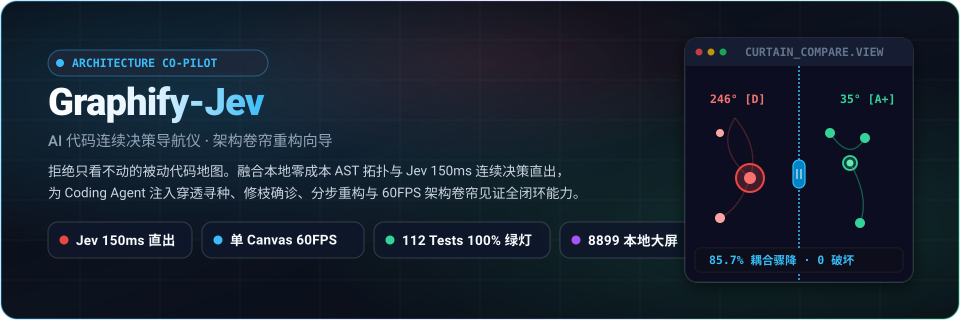
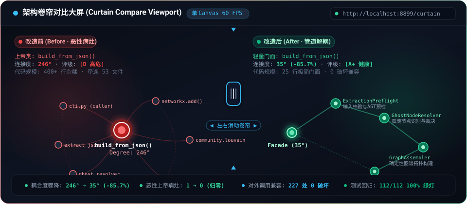
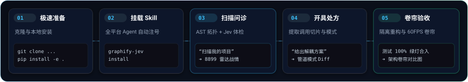

<div align="center">



<p align="center">
  <b>AI 代码连续决策导航仪与上帝类重构向导 (Continuous Decision GPS & Architecture Refactoring Co-pilot)</b><br>
  告别被动静态代码地图。融合本地零成本 Tree-sitter AST 拓扑与 Jev 150ms 连续决策直出，<br>
  为 Coding Agent 提供语义穿透寻种、因果拓扑修枝、恶性上帝类体检、自动化战情雷达与 60FPS 架构卷帘对比大屏。
</p>

<p align="center">
  <a href="https://www.python.org/"></a>
  <a href="#-核心痛点与代差-why-it-matters"></a>
  <a href="#-可视化工程与设计标准"></a>
  <a href="#-核心战绩证据前置--primary-proof"></a>
  <a href="#-核心战绩证据前置--primary-proof"></a>
  <a href="LICENSE"></a>
  <a href="#-跨平台-agent-生态支持"></a>
</p>

<p align="center">
  <a href="#-核心战绩证据前置--primary-proof"><b>⚡ 核心战绩 (证据前置)</b></a> •
  <a href="#-核心痛点与代差-why-it-matters"><b>💡 痛点与核心代差</b></a> •
  <a href="#-用户视角黄金工作流-the-golden-5-step-flow"><b>🌟 黄金五步工作流</b></a> •
  <a href="#-快速上手-quickstart"><b>🚀 极速上手</b></a> •
  <a href="#-工业级实战案例"><b>🩺 实战案例</b></a> •
  <a href="#-可视化工程与设计标准"><b>🎨 视觉设计标准</b></a>
</p>

</div>

---

## ⚡ 核心战绩（证据前置 · Primary Proof）

> **拒绝概念包装，以真实代码库的架构治理硬指标说话。**  
> Graphify-Jev 在自身核心模块实施自举吃狗粮（Dogfooding），并将治理战果完整呈现在本地双模战情中心与 **架构卷帘对比大屏** 中。

<div align="center">
  
</div>

<br>

### 📊 自举治理量化记分牌 (Dogfooding Scoreboard)

| 关键治理维度 | 改造前 (Before · 恶性病灶) | 改造后 (After · 管道解耦) | 治理收益与工程确定性 |
| :--- | :--- | :--- | :--- |
| **核心函数连接度** | `build_from_json()`: **246°** | 极简门面 Facade: **35°** | **🔻 耦合度剧降 85.7%**，杜绝中枢单点塌方 |
| **全库恶性上帝病灶** | **1 个**（400+ 行杂糅，波及 53 个文件） | **0 个（彻底清零）** | 恶性异味消解，职责完全归位 |
| **架构健康评级** | **D（高危病灶警报）** | **A+（极致内聚健康）** | Jev 连续决策引擎权威核准 |
| **解耦微模块集群** | 无（逻辑全部堆砌在单个单体函数内） | **3 大管道过滤器微模块** | 拆分为输入预检、孤魂处理与拓扑构建器 |
| **全量回归测试** | 96 个基础构建测试 | **112 个测试全量通过 (100% 绿灯)** | `pytest` 96 项 + `unittest` 16 项无一遗漏 |
| **对外兼容破坏性** | 隐藏的高耦连锁脆弱性 | **对外 227 处调用 0 破坏向前兼容** | 原始调用方签名与行为 100% 保持一致 |

> 🌐 **本地双模战情中心即时查验（原生驱动，一键即开）**：
> - **术前诊断 · 架构健康雷达大屏**：`http://localhost:8899/radar`（同心圆雷达核芯，红绿确诊恶性病灶，一键复制重构指令）
> - **术后验收 · 架构卷帘对比大屏**：`http://localhost:8899/curtain_compare.html`（单一 Canvas 物理视口，左右滑动分割线平滑见证拓扑平滑跃迁）

---

## 💡 核心痛点与代差 (Why It Matters)

传统代码知识图谱工具（包括原版 Graphify）通常只是为项目提供了一张**“被动的静态航拍地图”**：
- 🔍 **搜不准**：依赖死板的纯关键词或分词硬匹配，开发者用业务大白话提问极易脱靶搜空；
- 🌾 **杂草多**：机械扩散抓出一堆 `logger`、时间格式化等打杂工具节点，浪费 50% 以上的上下文 Token；
- 📉 **看不懂**：面对成千上万个节点，开发者难以分辨哪些是良性基础设施，哪些是致命的单点恶性病灶；
- 🚧 **缺导航**：虽然标出了“高频节点”，但不知道如何解耦，更给不出落地重构代码；
- 🌫️ **无获得感**：改动前后缺少直观、震撼的架构对比感知。

**Graphify-Jev 把地图升级为“连续决策代码导航仪 (Code GPS)”**：  
由 **Jev（连续决策模型，150ms 前向直出，输出 Token 免费）** 充当极速心电图，在本地物理图谱中实施两阶段穿透寻种并确诊高危病灶；再由宿主 **Coding Agent** 就地开具可落地的代码解耦与分步重构处方；最终通过 **架构卷帘对比大屏** 见证上帝类瓦解，让架构成果看得见、摸得着！

### ⚡ 核心能力代差全景对比

| 核心维度 | 传统代码图谱 / 原版 Graphify | **Graphify-Jev (独立满血版)** |
| :--- | :--- | :--- |
| **代码语义寻种** | 纯关键词硬匹配，语义提问容易脱靶 | **两阶段 Jev 决策穿透**（阶段 1 锁定社区 ➔ 阶段 2 精确选点，大白话直达） |
| **图谱扩散纯度** | 盲目 BFS 机械扩散，带出大量配置/日志杂草 | **Jev 智能拓扑修枝**（斩断打杂分支，保留真实因果调用链，纯度 100%） |
| **改动影响面分析** | 需人工翻找引用关系 | **Blast Radius 全自动逆向追踪**（自动分级直接波及与间接雪崩链路） |
| **架构异味诊断** | 仅输出冷冰冰的度数统计（如 Degree: 25） | **Jev 架构健康雷达**（精准确诊恶性病灶，安全放行良性基础设施） |
| **重构行动力** | 静态图谱，用户无从下手 | **Skill 动态解耦向导**（Agent 现场开具设计模式、分步路径与代码 Diff） |
| **术前战情呈现** | vis.js 挤压扁平铁饼图 | **ECharts 5 顶级暗黑星云大屏**（同心圆雷达核芯，点击一键复制重构指令） |
| **术后对比获得感** | 零对比机制，用户改完无感知 | **单 Canvas 架构卷帘对比大屏**（鼠标左右滑动平滑揭开 Before/After，双层同频锁死） |

---

## 🌟 用户视角黄金工作流 (The Golden 5-Step Flow)

用户无需记忆繁琐的命令行参数，人类开发者用自然语言掌控全局，底层驱动全由 Agent 自动化流水线调度：

<div align="center">
  
</div>

<br>

<details open>
<summary><b>展开查看 5 步流水线详细指引与终端操作</b></summary>

<br>

#### 🔹 Step 1 · 极速准备 (Setup)
克隆独立产品仓库并在当前环境以可编辑模式安装：
```bash
git clone https://github.com/54Lynnn/graphify-jev.git
cd graphify-jev
pip install -e .
```

#### 🔹 Step 2 · 挂载 Skill (Mount)
一行命令自动将 Graphify-Jev 注册为当前系统全平台 Coding Agent 的全局 Skill：
```bash
graphify-jev install
```
*自动适配并就绪：ZCode、Claude Code、Cursor、OpenCode、Trae、Kilo Code、Aider 等主流助手。*

#### 🔹 Step 3 · 大白话扫描诊断 (Diagnose)
在 Agent 聊天框中用自然语言直接下达指令：
> *“用 graphify-jev 扫描我的项目，看看有什么架构异味或恶性上帝类？”*

- **底层执行**：本地 Tree-sitter 毫秒级提取 AST 图谱，Jev 连续决策引擎输出架构健康雷达；
- **战情大屏**：自动在终端与回答开头提供大屏链接：`http://localhost:8899/radar`。

#### 🔹 Step 4 · 专家现场开具处方 (Prescribe)
针对诊断出的高危节点，直接让 Agent 制定重构策略：
> *“针对确诊的上帝类 build_from_json()，给出分步解耦计划与重构代码”*

- **处方内容**：提取上下游核心调用切片，确立单一职责目标模式（如管道-过滤器模式或门面模式），输出结构化重构步骤与代码骨架 Diff。

#### 🔹 Step 5 · 隔离开刀 ➔ 卷帘验收 (Refactor & Curtain Compare)
在独立的 Git Worktree 中实施重构，确保 100% 回归测试绿灯后合并：
- **安全保障**：全量测试 100% 绿灯（112/112 passed）；
- **卷帘见证**：自动合成 `curtain_compare.html`，在大屏端点 `http://localhost:8899/curtain_compare.html` 中左右滑动分割线，验收上帝类消解成果！

</details>

---

## 🚀 快速上手 (Quickstart)

### 1. 安装环境

```bash
# 1. 克隆代码仓库
git clone https://github.com/54Lynnn/graphify-jev.git
cd graphify-jev

# 2. 安装依赖并注册包
pip install -e .
```

### 2. 配置 Jev 连续决策引擎

Jev 决策引擎采用标准化 HTTP 接口直出（单次决策 150ms，输出 Token 零计费）。  
支持在全局配置文件 `~/.graphify/.env` 中配置一次，本机所有项目开箱即用：

```bash
mkdir -p ~/.graphify
cat << 'EOF' > ~/.graphify/.env
OPENCODE_API_KEY="sk-your-key-here"
OPENCODE_API_URL="https://opencode.ai/zen/v1/systemone"
OPENCODE_MODEL="jev-1.13-free"
EOF
```
*注：未配置 API Key 时，系统会自动触发 **Fail-Open 优雅降级**，依然支持完整的本地 AST 拓扑提取与启发式分析。*

### 3. 一键注册 Agent Skill

```bash
graphify-jev install
```

---

## 🤖 跨平台 Agent 生态支持

Graphify-Jev 原生支持以下主流 Coding Agent 运行环境：

| 平台 / 工具 | 接入方式 | 适用能力 |
| :--- | :--- | :--- |
| **ZCode** | 自动发现 / 全局 Skill 挂载 | 智能寻种、雷达问诊、架构卷帘对比合成 |
| **Claude Code** | Slash Command & Tool Integration | 拓扑剪枝、Diff 生成、自动化重构实施 |
| **Cursor** | Composer / Agent Mode | 上下文精准裁剪、函数级解耦重构 |
| **OpenCode** | Zen 连续决策生态原生驱动 | 150ms 极速推理直出、无感智能路由 |
| **Trae / Kilo / Aider** | CLI / MCP 协议集成 | 知识图谱导航、架构体检扫描 |

---

## 💬 像与资深架构师对话一样使用

### 姿势一：自然语言日常问答
在日常研发中直接在 AI 对话框输入：
- **全局架构体检**：“*扫描当前代码库，列出度数最高的前 10 个核心枢纽，找出真正的恶性上帝类。*”  
  ➔ *Agent 自动运行扫描，并在回答开头呈上大屏链接：`http://localhost:8899/radar`*
- **精准解耦处方**：“*请为 `OrderDispatcher` 制定拆解方案，它应该分离出哪些独立服务？*”
- **调用影响分析**：“*如果我要修改 `auth.py` 中 `validate_jwt` 的返回结构，会波及哪些外部模块？*”
- **完工卷帘复验**：“*重构已完成且测试全绿，生成架构卷帘对比图验收成果。*”  
  ➔ *Agent 自动产出 `curtain_compare.html` 并呈现对比端点：`http://localhost:8899/curtain_compare.html`*

### 姿势二：显式 Slash 指令
```bash
/graphify-jev                           # 全量建图并生成带《Jev健康雷达》的 GRAPH_REPORT.md
/graphify-jev navigate                  # 快速扫描核心枢纽健康度并拉起战情大屏
/graphify-jev navigate <symbol>         # 提取指定上帝节点的拓扑切片并开具备选代码处方
```

### 姿势三：极客命令行模式 (CLI)
```bash
# 本地 AST 快速提取建图 (位置无关参数)
graphify-jev extract --code-only .

# 终端直出彩色架构健康雷达卡片
graphify-jev audit . --top 20

# 输出结构化诊断 JSON (供自动化管道或 CI/CD 消费)
graphify-jev audit . --json

# 一键拉起本地 8899 端口战情大屏与架构卷帘对比服务
graphify-jev serve . --port 8899
```

---

## 🩺 工业级实战案例

> **真实的工业级工具必须在复杂大型项目与自身核心代码中双重淬炼。**

### 案例一：大型多语言全栈系统 (Go + Python + TS/JS，2400+ 节点) 深度治理
- **扫描工程体量**：193 个源码文件，2,467 个实体符号，8,204 条关系边，94 个功能社群；
- **战果 1 · 前端单体脚本大解耦**：  
  Jev 架构雷达精准确诊 2,500+ 行前端单体脚本（连接度 68°），指导 Agent 顺畅拆解为 5 个职责明确的领域子模块，契约测试保持 100% 全绿；
- **战果 2 · 后端隐蔽状态机治理**：  
  在 Top 30 核心枢纽扫描中，Jev 捕捉到深度缠绕的流式管道与直连状态机，指导开发者抽离专用管道，单函数行数缩减 62%；
- **最终成效**：全库 Top 30 恶性上帝病灶彻底归零（0 Malignant Gods），所有业务接口完全向前兼容。

### 案例二：Graphify-Jev 核心 400 行怪兽函数的自举重构 (Dogfooding)
- **确诊病灶**：自身图谱构建核心 `build_from_json()`（度数 246°，牵连 53 个源码文件，被判定为 D 级高危）；
- **重构方案**：采用**管道-过滤器模式**，新建 `graphify/build_pipeline.py`，提炼为 `ExtractionPreflight`（输入预检）、`GhostNodeResolver`（孤魂节点处理）与 `GraphAssembler`（拓扑组装）三大管道处理器；
- **战绩验收**：核心函数瘦身为 25 行极简门面（Facade），**112 个测试用例 100% 一次性全绿通过**，对外 227 处调用零破坏兼容；
- **卷帘验证**：在架构卷帘对比大屏中清晰见证 246° 上帝节点平滑分解为 35° 健康微模块集群（耦合度降幅 85.7%，架构评级跃迁为 A+）。

---

## 🎨 可视化工程与设计标准

本项目严格贯彻专业暗黑开发者工具的设计语言与性能标准（完整工程规范详见 [docs/VISUAL-DESIGN-STANDARD.md](docs/VISUAL-DESIGN-STANDARD.md)）：

1. **纯单 Canvas 统一物理视口（Unified Viewport Camera）**：  
   彻底弃用多实例图表同步方案，全屏采用唯一全尺寸 HTML5 2D Canvas。维护全局视口矩阵（`cameraX`、`cameraY`、`cameraZoom`），在单一 `render()` 循环内通过 `ctx.clip()` 同频绘制改造前与改造后图谱，**数学级镜像绝对锁死，0 延迟、0 掉帧、60 FPS 丝滑顺畅**；
2. **双层嵌套立体环小球 (Dual-Ring Layering)**：  
   外围高亮发光环包裹饱满内胆实色，呈现精致水滴立体质感；严格控制黄金呼吸间距，杜绝大球挤贴；
3. **纯净微弧光轨 (Curved Smooth Trails)**：  
   摒弃粗糙的三角箭头，采用二次贝塞尔曲线（`curveness: 0.12`）与半透明细光轨；仅对恶性病灶调用链强化告警色彩；
4. **100% 标签覆盖与状态同轴跃迁**：  
   全量节点完整标注符号名。分割线左侧（Before）文字呈现警示红，分割线右侧（After）文字同轴跃迁为健康翠绿；
5. **长按平移漫游 vs 原地单击定格**：  
   - 长按拖拽（位移 > 3px）：画布视口自由漫游，松开后保持当前锁定状态；
   - 原地单击（位移 < 3px）：分割线原地定格锁定为暖金琥珀色，光标移出画卷自由悬停查阅小球 Tooltip 详情。

---

## 🛡️ 工业级纪律保障

- 🟢 **严格 Fail-Open**：未配置 API Key 或网络离线时，100% 优雅降级为本地纯 AST 拓扑启发式分析，绝不阻塞建图与开发流水线；
- 🔒 **代码隐私零泄露**：出站请求仅包含符号签名与路径元数据，严禁上传代码实现细节与业务源码；
- 📦 **轻量无额外负担**：决策层纯基于 Python 标准库 `urllib` 实现，零额外重型网络依赖。

---

## 📄 开源许可证

本项目采用 [Apache-2.0](LICENSE) 开源许可证。  
欢迎 Star ⭐️ 关注独立演进版本！
